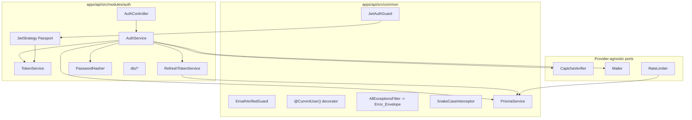

# Design Document

## Overview

The Authentication module (`auth`) is the foundational, security-critical module of the Avyo MVP. It implements account signup, credential-based login issuing HS256 JWT access tokens and rotating refresh tokens, email verification, password reset, session revocation (logout), and delivery of the authenticated user's profile plus a dynamic navigation menu. It also establishes the multi-tenant identity foundation (`user_id` binding) that every other MVP module depends on.

The module lives at `apps/api/src/modules/auth/` and follows the locked stack: **NestJS 11** (Express v5), **@nestjs/jwt + Passport**, **Prisma 6**, **PostgreSQL 17**, **TypeScript 5.6+**, **Node 22 LTS**, in a **pnpm** monorepo. All API request and response bodies use `snake_case`; shared contract types live in `packages/types` (`@avyo/types`).

### Scope of this design

- Endpoints: `POST /auth/signup`, `/auth/login`, `/auth/refresh`, `/auth/logout`, `/auth/verify-email`, `/auth/forgot-password`, `/auth/reset-password`, `/auth/me`.
- Cross-cutting infrastructure that auth introduces into `apps/api/src/common/`: `JwtAuthGuard`, `EmailVerifiedGuard`, `@CurrentUser()` decorator, the global error-envelope exception filter, and the global snake_case serialization behavior. These are placed in `common/` because they are consumed by every other module.
- Data models added to `apps/api/prisma/schema.prisma`: `User`, `RefreshToken`, `EmailVerificationToken`, `PasswordResetToken`.

### Design decisions requiring confirmation (new dependencies / open decisions)

These are flagged explicitly because they fall outside the locked dependency list or are recorded as open decisions in the requirements:

1. **Password hashing library** — proposed: **`argon2`** (see Password Hashing below). This is a new runtime dependency to confirm. `bcrypt` is an acceptable alternative.
2. **Rate limiting** — `@nestjs/throttler` is a natural fit but is **not** in the locked stack, and its default store is per-instance in-memory (insufficient for per-email counting and multi-instance deployments). This design specifies a provider-agnostic `RateLimiter` abstraction so the concrete backing (throttler, custom Postgres/Redis counter) can be decided without changing call sites. Adopting `@nestjs/throttler` or any store library is a **dependency to confirm**.
3. **Captcha provider** — deferred (open decision). Design uses a provider-agnostic `CaptchaVerifier` interface.
4. **Transactional email provider** — deferred (open decision). Design uses a provider-agnostic `Mailer` interface.
5. **Refresh token default lifetime** (`REFRESH_EXPIRES_IN`) — value not fixed by requirements; treated as a required env var (no hardcoded default).

The module will not implement hashing, JWT, captcha, or email from scratch — it depends on `@nestjs/jwt` for tokens and on the confirmed hashing library, behind abstractions for captcha and mail.

## Architecture

### Layered structure

```
HTTP request
    │
    ▼
[Global] RateLimitGuard ──▶ ValidationPipe ──▶ Controller ──▶ Service ──▶ PrismaService
    │                            │                                │
    │                            │                                ├─▶ TokenService (@nestjs/jwt, HS256)
    │                            │                                ├─▶ PasswordHasher (argon2)
    │                            │                                ├─▶ CaptchaVerifier (provider-agnostic)
    │                            │                                └─▶ Mailer (provider-agnostic)
    │                            ▼
    │                    Error_Envelope on failure
    ▼
[Global] AllExceptionsFilter ──▶ snake_case Error_Envelope
[Global] SnakeCaseInterceptor ──▶ snake_case success bodies
```

Guards run in this order on protected routes: `JwtAuthGuard` (authenticates and binds tenant identity) then `EmailVerifiedGuard` (business-route gating). `RateLimitGuard` is applied only to `/auth/login`, `/auth/signup`, and `/auth/forgot-password`.

### Component diagram



### Passport / JWT strategy

- **Algorithm:** HS256 with the symmetric secret from `JWT_SECRET` (Req 10.1).
- **JwtStrategy** (`passport-jwt`) extracts the token from the `Authorization: Bearer` header, verifies the signature and expiry against `JWT_SECRET`, and returns a principal `{ user_id }` derived **only** from the token `sub` claim (Req 11.1, 11.4). Signature failures and expiry both yield `UNAUTHENTICATED` (Req 10.4, 10.5).
- **Access token claims:** `sub` = User UUID, `iat`, `exp` (issuance + lifetime). Lifetime is `JWT_EXPIRES_IN` or `86400` seconds when that variable is absent/empty/whitespace (Req 10.2, 2.2).
- **JwtAuthGuard** wraps the strategy and, on success, attaches the principal to the request; `@CurrentUser()` reads it. On any failure it rejects without binding a tenant identifier (Req 11.2).

### Refresh token model and rotation

Refresh tokens are **opaque high-entropy random strings** returned to the client. Only a **hash** of each token is persisted (`token_hash`), never the raw value, so a database read cannot reconstruct usable tokens. The raw token is additionally signed/derived using `REFRESH_SECRET` so a presented token can be integrity-checked before a database lookup (Req 10.3). Each token belongs to a **chain/family** (`chain_id`) created at login; rotation links tokens via `parent_id`/successor.

Rotation algorithm on `POST /auth/refresh`:

```
1. Validate body: refresh_token must be a non-empty, non-whitespace string  -> else 400 VALIDATION_ERROR (Req 3.5)
2. Integrity-check the token against REFRESH_SECRET; compute token_hash.
3. Look up the RefreshToken row by token_hash.
   - not found                              -> 401 UNAUTHENTICATED, no state change (Req 3.4)
4. If row.revoked OR row.expires_at <= now:
   - If a successor exists for this row (already rotated) -> REUSE DETECTED:
        revoke every token in row.chain_id  -> 401 UNAUTHENTICATED (Req 3.3)
   - Else (plainly revoked/expired)         -> 401 UNAUTHENTICATED, other chains unchanged (Req 3.4)
5. If row has a successor (row itself already rotated but not marked revoked) -> REUSE DETECTED:
        revoke every token in row.chain_id  -> 401 UNAUTHENTICATED (Req 3.3)
6. Otherwise (valid, unrevoked, unexpired, no successor):
   - Generate new access_token + new refresh_token (both differ from presented).
   - In a single transaction: mark presented token revoked, insert successor
     in the same chain_id with parent_id = presented row id.
   - 200 with new tokens (Req 3.1, 3.2)
```

Reuse detection (step 4/5) revokes the **entire family**, which is the standard mitigation for stolen-then-replayed refresh tokens. Logout and password reset also revoke tokens by marking rows `revoked = true` (Req 4.1, 7.3).

### Anti-enumeration and constant-time behavior

- `forgot-password` always returns `204` with an empty body whether or not the email exists (Req 6.1, 6.2, 6.4). Email sending for existing accounts is dispatched **asynchronously** (fire-and-forget after the response path decision) so that the synchronous response time does not depend on whether an email was sent, keeping the timing difference within budget (Req 6.5). A minimum-work floor (always compute the same lookup + a dummy hash for the non-existent branch) is applied to avoid timing side channels.
- `login` returns the same `UNAUTHENTICATED` result for unknown email and wrong password, and performs a password verification against a dummy hash when the user is not found, so response timing does not reveal account existence (Req 2.5).

### Global cross-cutting concerns

- **AllExceptionsFilter** (in `common/filters/`): catches all thrown errors and maps them to the `Error_Envelope` `{ error: { code, message, details } }`. Known `AppException`s carry an explicit code from the allowed set; unmapped errors become `500 INTERNAL` (Req 12.1, 12.2, 12.6). `details` is `[]` when there is no field-level detail (Req 12.5).
- **SnakeCaseInterceptor** (in `common/interceptors/`): serializes all success response bodies (including nested keys) to `snake_case` (Req 12.3). Inbound bodies are defined as snake_case DTOs and validated by the global `ValidationPipe`, whose errors are transformed by the filter into `VALIDATION_ERROR` with one `details` entry per invalid field (Req 12.4).
- **Env validation** already exists (`src/config/env.validation.ts`) and collects **all** missing/invalid variables; `JWT_SECRET`, `REFRESH_SECRET`, `JWT_EXPIRES_IN`, `REFRESH_EXPIRES_IN`, `DATABASE_URL`, `PORT` are required and startup aborts reporting every offender (Req 10.6). This design keeps that behavior and relies on it.

### Password hashing

**Decision: use `argon2` (Argon2id).** Rationale within the locked stack: Argon2id is the current OWASP-recommended password hashing algorithm, is memory-hard (stronger against GPU/ASIC brute force than bcrypt), has a well-maintained Node 22-compatible native binding, and stores its parameters inside the encoded hash so cost can be tuned without schema changes. `bcrypt` remains an acceptable alternative (72-byte input truncation is its main caveat). Whichever is chosen is a **new dependency to confirm** since neither is in the locked list. The design isolates the choice behind a `PasswordHasher` interface (`hash(plain)`, `verify(hash, plain)`), so swapping implementations touches one provider only. Password and `password_hash` are never included in any response body (Req 1.3).

## Components and Interfaces

### Directory layout (`apps/api/src/modules/auth/`)

```
auth/
├── auth.module.ts
├── auth.controller.ts
├── auth.service.ts
├── token.service.ts              # access-token signing/verification (@nestjs/jwt)
├── refresh-token.service.ts      # rotation, reuse detection, chain revocation
├── password.hasher.ts            # PasswordHasher impl (argon2)
├── jwt.strategy.ts               # Passport JwtStrategy
├── ports/
│   ├── captcha-verifier.ts       # CaptchaVerifier interface + token
│   ├── mailer.ts                 # Mailer interface + token
│   └── rate-limiter.ts           # RateLimiter interface + token
└── dto/
    ├── signup.dto.ts
    ├── login.dto.ts
    ├── refresh.dto.ts
    ├── verify-email.dto.ts
    ├── forgot-password.dto.ts
    ├── reset-password.dto.ts
    └── responses (shared shapes re-exported from @avyo/types)
```

Common infra added/used in `apps/api/src/common/`: `guards/jwt-auth.guard.ts`, `guards/email-verified.guard.ts`, `decorators/current-user.decorator.ts`, `filters/all-exceptions.filter.ts`, `interceptors/snake-case.interceptor.ts`, `prisma/prisma.service.ts`.

### Controller endpoints

| Method | Path | Guards | Success | DTO |
|--------|------|--------|---------|-----|
| POST | `/auth/signup` | RateLimit | 201 `{ id, email, email_verified_at }` | `SignupDto` |
| POST | `/auth/login` | RateLimit | 200 `{ access_token, refresh_token, token_type, expires_in }` | `LoginDto` |
| POST | `/auth/refresh` | — | 200 `{ access_token, refresh_token, token_type, expires_in }` | `RefreshDto` |
| POST | `/auth/logout` | JwtAuth | 204 empty | — |
| POST | `/auth/verify-email` | — | 204 empty | `VerifyEmailDto` |
| POST | `/auth/forgot-password` | RateLimit | 204 empty | `ForgotPasswordDto` |
| POST | `/auth/reset-password` | — | 204 empty | `ResetPasswordDto` |
| POST | `/auth/me` | JwtAuth | 200 `{ user, menu }` | — |

`/auth/me` and `/auth/logout` use `JwtAuthGuard` but **not** `EmailVerifiedGuard` (unverified users can read their profile and log out, Req 8.4). `EmailVerifiedGuard` is applied globally to Business_Routes in other modules (Req 5.4).

### Key interfaces (contracts, TypeScript)

```typescript
// ports/captcha-verifier.ts
export interface CaptchaVerifier {
  // Resolves true when both challenge fields pass provider validation.
  verify(captcha0: string, captcha1: string, clientIp?: string): Promise<boolean>;
}
export const CAPTCHA_VERIFIER = Symbol('CAPTCHA_VERIFIER');

// ports/mailer.ts
export interface Mailer {
  sendVerificationEmail(to: string, token: string): Promise<void>;
  sendPasswordResetEmail(to: string, token: string): Promise<void>;
}
export const MAILER = Symbol('MAILER');

// ports/rate-limiter.ts
export interface RateLimitWindow { windowSeconds: number; maxPerIp: number; maxPerEmail: number; }
export interface RateLimiter {
  // Records a hit and returns a decision incl. retry_after when limited.
  hit(endpoint: string, ip: string, email: string | null):
    Promise<{ allowed: boolean; retryAfterSeconds: number }>;
}
export const RATE_LIMITER = Symbol('RATE_LIMITER');

// password.hasher.ts
export interface PasswordHasher {
  hash(plain: string): Promise<string>;
  verify(hash: string, plain: string): Promise<boolean>;
}

// token.service.ts
export interface AccessTokenClaims { sub: string; iat: number; exp: number; }
```

### Guards and decorator

- `JwtAuthGuard` (`common/guards`): delegates to Passport `jwt` strategy; binds `{ user_id }` from the validated token to `request.user` (Req 11.1, 11.2, 11.4).
- `EmailVerifiedGuard` (`common/guards`): reads the authenticated user's `email_verified_at`; if null, throws `EMAIL_NOT_VERIFIED` (403) without any state change (Req 5.4). Assumes `JwtAuthGuard` ran first.
- `@CurrentUser()` (`common/decorators`): parameter decorator returning the bound tenant identity (`user_id`) sourced solely from the token (Req 11.4).

## Data Models

Prisma models added to `apps/api/prisma/schema.prisma`. UUID PKs via `gen_random_uuid()`, `timestamptz` timestamps, and the multi-tenant `user` table that all business tables reference.

```prisma
model User {
  id               String    @id @default(dbgenerated("gen_random_uuid()")) @db.Uuid
  name             String    @db.VarChar(255)
  email            String    @unique @db.VarChar(254)
  passwordHash     String    @map("password_hash")
  emailVerifiedAt  DateTime? @map("email_verified_at") @db.Timestamptz(6)
  plan             String    @default("ctrlsale")
  createdAt        DateTime  @default(now()) @map("created_at") @db.Timestamptz(6)
  updatedAt        DateTime  @updatedAt @map("updated_at") @db.Timestamptz(6)

  refreshTokens          RefreshToken[]
  emailVerificationTokens EmailVerificationToken[]
  passwordResetTokens     PasswordResetToken[]

  @@map("user")
}

model RefreshToken {
  id           String    @id @default(dbgenerated("gen_random_uuid()")) @db.Uuid
  userId       String    @map("user_id") @db.Uuid
  tokenHash    String    @unique @map("token_hash")
  chainId      String    @map("chain_id") @db.Uuid
  parentId     String?   @unique @map("parent_id") @db.Uuid
  revoked      Boolean   @default(false)
  expiresAt    DateTime  @map("expires_at") @db.Timestamptz(6)
  userAgent    String?   @map("user_agent") @db.VarChar(512)
  os           String?   @db.VarChar(128)
  browser      String?   @db.VarChar(128)
  createdAt    DateTime  @default(now()) @map("created_at") @db.Timestamptz(6)

  user     User          @relation(fields: [userId], references: [id], onDelete: Cascade)
  parent   RefreshToken? @relation("RefreshChain", fields: [parentId], references: [id])
  successor RefreshToken? @relation("RefreshChain")

  @@index([userId])
  @@index([chainId])
  @@map("refresh_token")
}

model EmailVerificationToken {
  id         String    @id @default(dbgenerated("gen_random_uuid()")) @db.Uuid
  userId     String    @map("user_id") @db.Uuid
  tokenHash  String    @unique @map("token_hash")
  expiresAt  DateTime  @map("expires_at") @db.Timestamptz(6)
  usedAt     DateTime? @map("used_at") @db.Timestamptz(6)
  createdAt  DateTime  @default(now()) @map("created_at") @db.Timestamptz(6)

  user User @relation(fields: [userId], references: [id], onDelete: Cascade)

  @@index([userId])
  @@map("email_verification_token")
}

model PasswordResetToken {
  id         String    @id @default(dbgenerated("gen_random_uuid()")) @db.Uuid
  userId     String    @map("user_id") @db.Uuid
  tokenHash  String    @unique @map("token_hash")
  expiresAt  DateTime  @map("expires_at") @db.Timestamptz(6)
  usedAt     DateTime? @map("used_at") @db.Timestamptz(6)
  createdAt  DateTime  @default(now()) @map("created_at") @db.Timestamptz(6)

  user User @relation(fields: [userId], references: [id], onDelete: Cascade)

  @@index([userId])
  @@map("password_reset_token")
}
```

Notes:
- `parentId` is unique and the self-relation `RefreshChain` models parent → successor 1:1 linkage; the presence of a successor for a presented token drives reuse detection.
- Single-use tokens (`EmailVerificationToken`, `PasswordResetToken`) carry `expires_at` and `used_at`; "used" = `used_at is not null`.
- Verification/reset tokens store only a **hash** of the delivered token, consistent with refresh-token handling.
- `email` is stored and compared case-insensitively (uniqueness enforced at the app layer with normalization to lowercase before persistence, plus the `@unique` constraint) (Req 1.5, 9.1).

### Shared contract types (`@avyo/types`)

Request/response shapes (`SignupResponse`, `LoginResponse`, `AuthMeResponse`, `MenuEntry`, `ErrorEnvelope`, `ErrorDetail`) are declared in `packages/types` in `snake_case` and imported by both `apps/api` and `apps/web`.

## Correctness Properties

*A property is a characteristic or behavior that should hold true across all valid executions of a system — essentially, a formal statement about what the system should do. Properties serve as the bridge between human-readable specifications and machine-verifiable correctness guarantees.*

The following properties were derived from the acceptance-criteria prework analysis. Property-based tests exercise the pure/deterministic logic layers (token rotation state machine, validation, serialization, tenant resolution) with mocked I/O ports (Prisma, Mailer, CaptchaVerifier), so 100+ iterations are cheap.

### Property 1: Signup never leaks credentials

*For any* valid signup input, the signup response body contains neither a `password` nor a `password_hash` field (at any nesting level), and the persisted user's `password_hash` is not equal to the plaintext password.

**Validates: Requirements 1.3**

### Property 2: Signup output invariants

*For any* accepted signup input, the created user has `email_verified_at` equal to null and `plan` equal to `ctrlsale`, and the response contains a valid version-4 UUID `id` and the submitted `email`.

**Validates: Requirements 1.1, 1.2, 11.3**

### Property 3: Duplicate email is rejected case-insensitively

*For any* existing user email and any case-variant of that email, a signup request with the variant is rejected with `409 CONFLICT` and creates no new user.

**Validates: Requirements 1.5**

### Property 4: Signup input validation

*For any* signup input where `name` is outside 1–255 chars, `email` is absent / exceeds 254 chars / is not RFC 5322 format, or `password` is outside 8–128 chars, the system responds `400 VALIDATION_ERROR` and persists no user.

**Validates: Requirements 1.6**

### Property 5: Login issues well-formed tokens

*For any* credentials matching an existing verified or unverified user with valid captcha and a complete device object, login responds `200` with a body containing `access_token`, `refresh_token`, `token_type` = `bearer`, and `expires_in` = 86400, and the access token is HS256-signed with `JWT_SECRET`.

**Validates: Requirements 2.1, 2.2, 2.8**

### Property 6: Login is indistinguishable for unknown email vs wrong password

*For any* login attempt with valid captcha/device where credentials do not match a user (unknown email or wrong password), the response is `401 UNAUTHENTICATED` and no tokens are persisted, with no field distinguishing the two failure causes.

**Validates: Requirements 2.5**

### Property 7: Login input validation

*For any* login request missing `email`, `password`, or `device`, or whose `device` omits or empties any of `user_agent`/`os`/`browser`, the response is `400 VALIDATION_ERROR`.

**Validates: Requirements 2.7**

### Property 8: Refresh rotation produces fresh, distinct tokens

*For any* valid, unrevoked, unexpired refresh token with no successor, a refresh request returns `200` with a new `access_token` and a new `refresh_token` that both differ from the presented token, `token_type` = `bearer`, and `expires_in` = 86400.

**Validates: Requirements 3.1**

### Property 9: Rotation invalidates the presented token (round-trip / single-use)

*For any* successful refresh, the presented refresh token is revoked and cannot be used again: an immediately following refresh with the same presented token does not succeed.

**Validates: Requirements 3.2**

### Property 10: Reuse of a rotated token revokes the whole chain

*For any* refresh token that has already been rotated (a successor exists), presenting it again revokes every token in its chain, issues no new tokens, and responds `401 UNAUTHENTICATED`.

**Validates: Requirements 3.3**

### Property 11: Invalid/revoked/expired refresh isolates other chains

*For any* non-empty refresh-token string that is revoked, expired, or unknown, the response is `401 UNAUTHENTICATED`, no new tokens are issued, and every other chain's tokens remain unchanged.

**Validates: Requirements 3.4**

### Property 12: Refresh input validation

*For any* refresh request where `refresh_token` is missing, null, empty, whitespace-only, or non-string, the response is `400 VALIDATION_ERROR` and no tokens are issued.

**Validates: Requirements 3.5**

### Property 13: Logout revokes only the current session

*For any* set of active sessions belonging to a user, logging out with a valid access token revokes exactly the refresh token bound to that access token's session and leaves all other sessions of the same user unchanged; a subsequent refresh with the revoked token yields `401 UNAUTHENTICATED`.

**Validates: Requirements 4.1, 4.3, 4.5**

### Property 14: Logout is idempotent

*For any* session whose refresh token is already revoked, a logout with a valid access token for that session responds `204` with an empty body and changes no additional session state.

**Validates: Requirements 4.4**

### Property 15: Unauthenticated logout changes nothing

*For any* logout request with no Bearer token or an expired/malformed/invalid access token, the response is `401 UNAUTHENTICATED` and no refresh token is revoked.

**Validates: Requirements 4.2**

### Property 16: Email verification is single-use and time-bounded

*For any* email-verification token: if it is unused and unexpired, verifying it sets `email_verified_at` to the current timestamp and responds `204`; if it is unknown, already used, or expired, `email_verified_at` is unchanged and the response is `422 UNPROCESSABLE`.

**Validates: Requirements 5.1, 5.2**

### Property 17: Verify-email input validation

*For any* verify-email request whose `token` is missing, null, non-string, empty, or exceeds 512 characters, the response is `400 VALIDATION_ERROR`.

**Validates: Requirements 5.3**

### Property 18: Unverified users are gated from business routes

*For any* business-route request authenticated by a user whose `email_verified_at` is null, the request is rejected `403 EMAIL_NOT_VERIFIED` with no state change; when `email_verified_at` is non-null the email-verification gate allows the request.

**Validates: Requirements 5.4, 5.5**

### Property 19: Forgot-password is indistinguishable regardless of account existence

*For any* well-formed email, whether or not it belongs to a user, forgot-password responds with the identical `204` status and empty body; an email is dispatched only when the account exists.

**Validates: Requirements 6.1, 6.2, 6.4**

### Property 20: Forgot-password input validation

*For any* forgot-password request whose `email` is missing, empty, exceeds 254 chars, or is not `local-part@domain` format, the response is `400 VALIDATION_ERROR` and no email is dispatched.

**Validates: Requirements 6.3**

### Property 21: Reset-password succeeds only for valid tokens and updates the hash

*For any* known, unexpired, unused reset token and a password of 8–128 chars, reset updates the user's `password_hash` to a hash of the new password and responds `204`; for any expired/unknown/used token, the hash is unchanged and the response is `422 UNPROCESSABLE`.

**Validates: Requirements 7.1, 7.4**

### Property 22: Reset-password consumes its token and revokes all sessions

*For any* successful reset, the presented reset token is marked used (a second use is rejected) and every active refresh token of that user is revoked (none can be exchanged afterward).

**Validates: Requirements 7.2, 7.3**

### Property 23: Reset-password input validation

*For any* reset-password request missing `token`, missing `password`, or with a `password` shorter than 8 or longer than 128 chars, the `password_hash` is unchanged and the response is `400 VALIDATION_ERROR`.

**Validates: Requirements 7.5**

### Property 24: `/auth/me` returns a complete, order-stable profile and menu

*For any* valid access token, `/auth/me` responds `200` with a `user` object carrying non-null `id`, `name`, `email`, `plan` (defaulting to `ctrlsale` when unassigned) and an `email_verified_at` field, plus a `menu` array whose entries each have non-empty `key`, `label`, `route`, `icon`, and the menu order is identical across repeated requests for the same user.

**Validates: Requirements 8.1, 8.2, 8.6**

### Property 25: `/auth/me` reflects verification state

*For any* user, `/auth/me` sets `user.email_verified_at` to null when the user is unverified and to the ISO 8601 verification timestamp when verified.

**Validates: Requirements 8.4, 8.5**

### Property 26: Unauthenticated `/auth/me` leaks no profile

*For any* `/auth/me` request without a Bearer token or with an invalid/expired token, the response is `401 UNAUTHENTICATED` and contains neither a `user` object nor a `menu` array.

**Validates: Requirements 8.3**

### Property 27: Rate limiting triggers at configured thresholds with retry-after

*For any* sequence of requests to a throttled endpoint within the window: once the per-IP count reaches the configured IP limit or the per-email count reaches the configured email limit (emails compared case-insensitively after trimming), the next request is rejected `429 RATE_LIMITED` without being processed and includes a whole-second retry-after; while both counts are below their limits, requests are forwarded for processing.

**Validates: Requirements 9.1, 9.2, 9.3, 9.4, 9.5**

### Property 28: Access-token lifetime resolution

*For any* value of `JWT_EXPIRES_IN` that is absent, empty, or whitespace-only, the issued access-token lifetime is 86400 seconds; otherwise it equals the configured value.

**Validates: Requirements 10.2**

### Property 29: Invalid or expired access tokens are rejected

*For any* access token whose signature does not validate against `JWT_SECRET`, or whose expiry has passed, the request is rejected `401 UNAUTHENTICATED` and no authenticated session is established.

**Validates: Requirements 10.4, 10.5**

### Property 30: Tenant identity always comes from the token

*For any* authenticated request, the resolved tenant identifier equals the `sub` of the validated access token, regardless of any conflicting `user_id` supplied in the body, query, or headers.

**Validates: Requirements 11.1, 11.4**

### Property 31: Error responses conform to the envelope contract

*For any* error the system returns, the body has exactly `error.code` (from the allowed code set), `error.message` (1–500 chars), and `error.details` (an array); when there is field-level detail, `details` has one `{ field (snake_case), message (1–500 chars) }` entry per invalid field, and is `[]` otherwise.

**Validates: Requirements 12.1, 12.2, 12.4, 12.5**

### Property 32: All body field names are snake_case

*For any* request or response body the system produces, every field name — including nested field names — is in `snake_case`.

**Validates: Requirements 12.3**

## Error Handling

All errors are emitted through the global `AllExceptionsFilter` as an `Error_Envelope`. The internal `AppException` hierarchy maps directly to allowed codes:

| Situation | HTTP | code |
|-----------|------|------|
| DTO/field validation failure, captcha failure | 400 | `VALIDATION_ERROR` |
| Bad credentials, missing/invalid/expired token, refresh invalid/revoked/expired/reused | 401 | `UNAUTHENTICATED` |
| (reserved for authorization) | 403 | `FORBIDDEN` |
| Business route accessed by unverified user | 403 | `EMAIL_NOT_VERIFIED` |
| Resource of another tenant / not found | 404 | `NOT_FOUND` |
| Duplicate email on signup | 409 | `CONFLICT` |
| Expired/unknown/used verification or reset token | 422 | `UNPROCESSABLE` |
| Rate limit exceeded | 429 | `RATE_LIMITED` (+ retry-after) |
| Uncaught / unmapped error | 500 | `INTERNAL` |

Rules:
- The filter never leaks stack traces or internal messages; `500 INTERNAL` uses a generic message (Req 12.6).
- Validation errors populate `details` with one snake_case `field`/`message` entry each; all other errors use `details: []` (Req 12.4, 12.5).
- Signup failures after successful validation roll back within a transaction so no partial user is persisted, returning `500 INTERNAL` (Req 1.8).
- Startup fails and reports **every** missing/invalid required env var before the server listens (Req 10.6) — handled by the existing `validateEnv`.
- Rate-limit rejections short-circuit before controller logic runs, so throttled requests never mutate state (Req 9.2, 9.3).

## Testing Strategy

Property-based testing **is applicable** to this feature: the token-rotation state machine, validation logic, serialization/snake_case transform, tenant resolution, and anti-enumeration branching are deterministic logic with large input spaces and clear universal properties. External I/O (Prisma, Mailer, CaptchaVerifier, real clock) is mocked so property tests run 100+ iterations cheaply; end-to-end wiring is covered by a smaller set of integration tests.

### Dual approach

- **Property-based tests** — cover Properties 1–32 above. Library: **`fast-check`** (the standard PBT library for the TypeScript/Jest ecosystem, Node 22 compatible). This is a **dev-dependency to confirm** as it is not in the locked list; it is test-only and does not affect the runtime stack. Each property test:
  - Runs a minimum of **100 iterations**.
  - Is tagged with a comment referencing the design property, format: `// Feature: auth, Property {number}: {property_text}`.
  - Implements exactly one correctness property.
  - Uses in-memory fakes for the Prisma repositories and the `CaptchaVerifier`/`Mailer`/`RateLimiter` ports.
- **Unit tests (example-based)** — concrete scenarios and edge cases: specific RFC 5322 email samples, boundary lengths (name 1/255, password 7/8/128/129, token 512/513), argon2 hash/verify round-trip, JWT sign/verify with a known secret, retry-after formatting.
- **Integration tests** — Nest e2e (`@nestjs/testing` + supertest) against a test PostgreSQL: full request→guard→service→Prisma path for each endpoint, verifying HTTP status, headers, and snake_case bodies; guard ordering (`JwtAuthGuard` then `EmailVerifiedGuard`); env-validation startup failure reporting all offenders. 1–3 examples per endpoint — not property-based.

### Timing-sensitive requirements

Requirements 6.5 (forgot-password timing within 500 ms) and the latency bounds in 4.1/6.1/8.1 are verified with targeted example-based timing assertions and by design (async email dispatch, constant-work floors), not with property-based tests, since wall-clock timing does not vary meaningfully across generated inputs and is environment-dependent.

### Requirements not covered by properties

- Async email delivery within 60 s (Req 1.4) and reset/verification email dispatch — verified via mock-based unit tests asserting the `Mailer` port was invoked with the right recipient/token; delivery latency is out of unit-test scope.
- Env startup failure reporting (Req 10.6) — covered by the existing `env.validation.spec.ts` and an integration boot test.

## Requirements Traceability

| Design component | Requirements |
|------------------|-------------|
| `AuthService.signup` + `PasswordHasher` + `Mailer` + `RateLimiter` | 1.1–1.9 |
| `AuthService.login` + `TokenService` + device recording + anti-enumeration | 2.1–2.8 |
| `RefreshTokenService` (rotation, reuse detection, chain revocation) | 3.1–3.5 |
| `AuthService.logout` + `RefreshTokenService.revoke` | 4.1–4.5 |
| `AuthService.verifyEmail` + `EmailVerificationToken` model | 5.1–5.3 |
| `EmailVerifiedGuard` | 5.4, 5.5 |
| `AuthService.forgotPassword` + anti-enumeration + async dispatch | 6.1–6.5 |
| `AuthService.resetPassword` + `PasswordResetToken` model + session revocation | 7.1–7.5 |
| `AuthController.me` + `Dynamic_Menu` builder | 8.1–8.6 |
| `RateLimitGuard` + `RateLimiter` port | 9.1–9.5 |
| `TokenService` + `ConfigModule`/`validateEnv` | 10.1–10.6 |
| `JwtAuthGuard` + `JwtStrategy` + `@CurrentUser()` + `User.id` UUID | 11.1–11.4 |
| `AllExceptionsFilter` + `SnakeCaseInterceptor` + DTOs | 12.1–12.6 |
```
