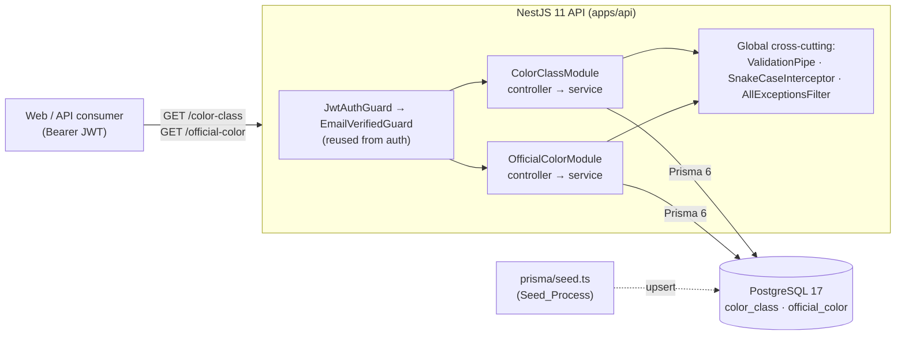
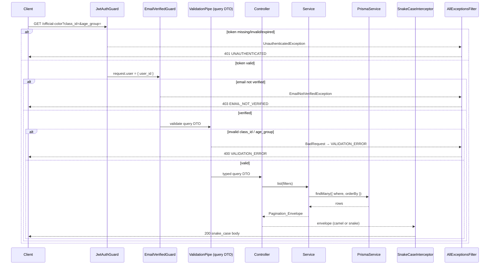
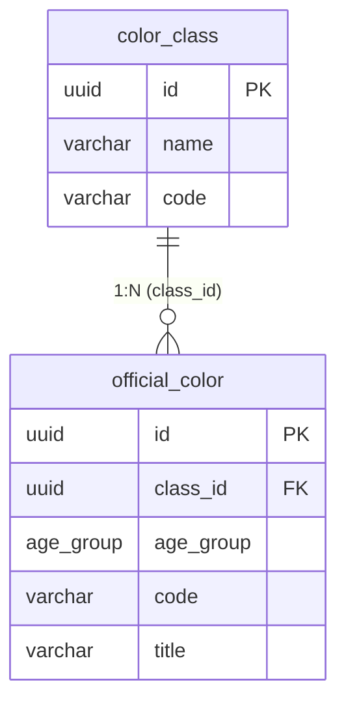
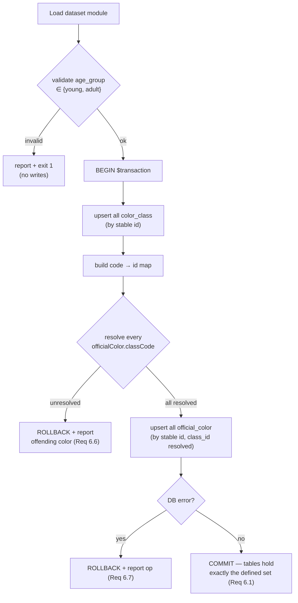

# Design Document

## Overview

The Color Catalogs feature exposes the two GLOBAL, official reference catalogs of the Avyo MVP:

- **Color Class** (`color-class` / Classe de Cor) — background/grouping categories of bird colors (fundo branco, amarelo, pastel…).
- **Official Color** (`official-color` / Cor Oficial) — recognized bird colors, each belonging to one Color Class, carrying an `age_group` (`young`/`adult`), a `code`, and a `title`.

Unlike every business module in the MVP, these catalogs are **not tenant-scoped**: they carry **no `user_id`**, are shared identically across all tenants, and are populated exclusively by the Prisma seed script (`apps/api/prisma/seed.ts`). From the API consumer's perspective they are strictly **read-only**, surfaced through two endpoints:

- `GET /color-class`
- `GET /official-color` (with optional `class_id` and `age_group` filters)

Both endpoints require a valid Bearer JWT and email verification, but return global data with no tenant filter. The design **reuses** the auth work already implemented (`JwtAuthGuard`, `EmailVerifiedGuard`, `AllExceptionsFilter`, `SnakeCaseInterceptor`, `@CurrentUser()`, `PrismaService`, and the `@avyo/types` contract package) rather than recreating any of it.

This design covers the two catalogs, their Prisma models, the native `age_group` enum, a migration, the two NestJS modules, the shared contract types, and the seed logic. The `bird_color` N:N junction (between `bird` and `official_color`) is explicitly **out of scope** — it belongs to the bird spec.

Canonical source of truth: `mvp-project.md` (sections 4.3, 5, 6, 11.2) and the steering files (`tech.md`, `structure.md`, `conventions-api.md`, `devops.md`).

### Design goals

1. **Global read semantics** — never apply a `user_id`/tenant filter; every verified user receives the identical dataset (Req 1.2, 2.2).
2. **Deterministic ordering** — byte-for-byte stable ordering across repeated identical requests (Req 1.5, 2.6).
3. **Reuse existing cross-cutting infrastructure** — guards, filter, interceptor, DTO validation pipe, shared types (Req 5, 7, 8).
4. **Referential integrity + variant support** — every official color references a real class; a color may exist as both `young` and `adult` under one class (Req 3.1, 3.5).
5. **Idempotent, transactional seeding** — repeatable runs converge to the same records; failures roll back (Req 6).

### Key design decisions

| Decision | Choice | Rationale |
|---|---|---|
| Tenant scoping | None — no `user_id` column, no query filter | Catalogs are global/official per `conventions-api.md` and Req 1.2 / 2.2. |
| Email-verification gating | Apply `EmailVerifiedGuard` (resolves the open decision) | Req 5.3 treats these as Business_Routes behind the `EMAIL_NOT_VERIFIED` gate, consistent with `mvp-project.md` §3.3. See "Open decisions". |
| Response envelope | `Pagination_Envelope` (default per Req 7.5) | Matches `conventions-api.md`; see "Open decisions" for the simple-list tradeoff. |
| `age_group` domain | Native Postgres enum `age_group` (`young`/`adult`) | Fixed domain per `conventions-api.md`; reuses the existing `age_group` enum already declared in `@avyo/types`. |
| Write endpoints | None exposed in this feature | Catalogs are read-only from the API; Req 3.6/3.7/3.8 write rules are enforced at the schema/seed layer, not via HTTP. See "Open decisions". |

## Architecture

### System context



The two modules are siblings; neither depends on the other at runtime. Both depend only on `PrismaService` and the reused guards. The seed script is a standalone Node process (run via `prisma db seed`) that writes to the same two tables.

### Request pipeline

Every catalog request flows through the same ordered pipeline. Cross-cutting concerns are already registered globally in `app.module.ts` (the `ValidationPipe`, `SnakeCaseInterceptor`, and `AllExceptionsFilter`); this feature only adds the two route handlers and their guards.



Guard order matters: `JwtAuthGuard` must run before `EmailVerifiedGuard` (which reads `request.user.user_id`). In NestJS the order in `@UseGuards(JwtAuthGuard, EmailVerifiedGuard)` is guaranteed left-to-right.

### Module layout (per `structure.md`)

```
apps/api/src/modules/
├── color-class/
│   ├── color-class.controller.ts
│   ├── color-class.service.ts
│   └── color-class.module.ts
└── official-color/
    ├── official-color.controller.ts
    ├── official-color.service.ts
    ├── dto/
    │   └── list-official-color.query.dto.ts
    └── official-color.module.ts
```

`color-class` needs no query DTO (no filters). `official-color` has a single query DTO for `class_id` + `age_group`. Both modules are already registered in `app.module.ts` (stub modules exist today and must be fleshed out).

## Components and Interfaces

### ColorClassModule

```typescript
@Module({
  controllers: [ColorClassController],
  providers: [ColorClassService, PrismaService, JwtAuthGuard, EmailVerifiedGuard],
})
export class ColorClassModule {}
```

> `JwtStrategy` backs `JwtAuthGuard` through Passport. Because `JwtAuthGuard` depends on the registered `jwt` strategy and `CONFIG`, the module imports `ConfigModule` and `PassportModule.register({ defaultStrategy: 'jwt' })` and registers `JwtStrategy` as a provider (mirroring `AuthModule`). Alternatively, `AuthModule` already `exports` `JwtAuthGuard`/`EmailVerifiedGuard`, so each catalog module MAY `imports: [AuthModule]` and reuse the exported guards directly. The design prefers importing `AuthModule` to avoid re-wiring the Passport strategy.

**ColorClassController**

```typescript
@Controller('color-class')
@UseGuards(JwtAuthGuard, EmailVerifiedGuard)
export class ColorClassController {
  constructor(private readonly service: ColorClassService) {}

  @Get()
  @HttpCode(200)
  list(): Promise<Pagination_Envelope<{ color_class: ColorClass[] }>> {
    return this.service.list();
  }
}
```

**ColorClassService**

```typescript
@Injectable()
export class ColorClassService {
  constructor(private readonly prisma: PrismaService) {}

  // Global read: NO user_id filter. Deterministic order by code asc.
  async list(): Promise<Pagination_Envelope<{ color_class: ColorClass[] }>> {
    const rows = await this.prisma.colorClass.findMany({
      orderBy: { code: 'asc' },
      select: { id: true, name: true, code: true },
    });
    return buildEnvelope('color_class', rows);
  }
}
```

### OfficialColorModule

```typescript
@Module({
  imports: [AuthModule],
  controllers: [OfficialColorController],
  providers: [OfficialColorService, PrismaService],
})
export class OfficialColorModule {}
```

**OfficialColorController**

```typescript
@Controller('official-color')
@UseGuards(JwtAuthGuard, EmailVerifiedGuard)
export class OfficialColorController {
  constructor(private readonly service: OfficialColorService) {}

  @Get()
  @HttpCode(200)
  list(
    @Query() query: ListOfficialColorQueryDto,
  ): Promise<Pagination_Envelope<{ official_color: OfficialColor[] }>> {
    return this.service.list(query);
  }
}
```

**ListOfficialColorQueryDto** (class-validator)

```typescript
export class ListOfficialColorQueryDto {
  // Req 3.3: non-UUID class_id → 400 VALIDATION_ERROR
  @IsOptional()
  @IsUUID('4')
  class_id?: string;

  // Req 4.2: value other than young/adult (incl. 'Young', 'ADULT', '', ' ') → 400
  @IsOptional()
  @IsEnum(age_group)
  age_group?: age_group;
}
```

> The global `ValidationPipe` is configured with `whitelist: true, forbidNonWhitelisted: true, transform: true`, so unknown query parameters are rejected and the DTO is materialized as a class instance. `@IsEnum(age_group)` (from `@avyo/types`) enforces exact, case-sensitive membership, satisfying Req 4.2's rejection of `Young`/`ADULT`/empty/whitespace.

**OfficialColorService**

```typescript
@Injectable()
export class OfficialColorService {
  constructor(private readonly prisma: PrismaService) {}

  // Global read: NO user_id filter. Filters are ANDed. Deterministic order:
  // class_id asc, then age_group asc, then code asc.
  async list(
    query: ListOfficialColorQueryDto,
  ): Promise<Pagination_Envelope<{ official_color: OfficialColor[] }>> {
    const where: Prisma.OfficialColorWhereInput = {
      ...(query.class_id ? { classId: query.class_id } : {}),
      ...(query.age_group ? { ageGroup: query.age_group } : {}),
    };
    const rows = await this.prisma.officialColor.findMany({
      where,
      orderBy: [{ classId: 'asc' }, { ageGroup: 'asc' }, { code: 'asc' }],
      select: { id: true, classId: true, ageGroup: true, code: true, title: true },
    });
    return buildEnvelope('official_color', rows);
  }
}
```

> **Ordering note (Req 1.5, 2.6):** the requirements demand ascending lexicographical (Unicode code point) ordering for `code`. PostgreSQL text ordering depends on the database collation; a locale-aware collation would not be byte/code-point ordered. To guarantee code-point ordering deterministically, the sort keys are compared under the `C` collation. This is expressed on the columns via `String @db.VarChar(...)` combined with an explicit `COLLATE "C"` on the `code` sort. Because Prisma's `orderBy` cannot attach a collation inline, the service either (a) relies on columns declared with a `C`-collation default, or (b) performs the final sort in application code over the already-filtered set (these catalogs are small and stable). The design chooses **(a) column-level `C` collation** on `color_class.code` and `official_color.code` so ordering is enforced at the database and stays stable across requests. `age_group` orders by its enum declaration order (`young` before `adult`), and `class_id` is a UUID compared as text under `C`.

### Envelope builder (shared helper)

Because these catalogs are small and stable, the envelope reports the full result set on a single page (`per_page = total`, `current_page = 1`). A small pure helper builds the `Pagination_Envelope` so both services stay thin and the shape is validated once:

```typescript
function buildEnvelope<K extends string, T>(
  key: K,
  rows: T[],
): Pagination_Envelope<Record<K, T[]>> {
  const total = rows.length;
  return {
    data: { [key]: rows } as Record<K, T[]>,
    links: { first: '', last: '', prev: null, next: null },
    meta: {
      current_page: 1,
      from: total === 0 ? null : 1,
      last_page: 1,
      per_page: total,
      to: total === 0 ? null : total,
      total,
    },
  };
}
```

> The `links` URLs are populated by the API's URL context (base path + query string). The exact link-building is a presentation concern shared with other list endpoints; the invariant this feature guarantees is the **envelope shape** (exactly `data`/`links`/`meta`, with `data` holding exactly one entity key), per Req 7.5.

### Interfaces summary

| Endpoint | Auth | Query | Success | Ordering |
|---|---|---|---|---|
| `GET /color-class` | Bearer + verified | none | `200` `{ data: { color_class: [] }, links, meta }` | `code` asc (C collation) |
| `GET /official-color` | Bearer + verified | `class_id?` (uuid), `age_group?` (young\|adult) | `200` `{ data: { official_color: [] }, links, meta }` | `class_id`, then `age_group`, then `code` asc |

## Data Models

### Shared contract types (`packages/types` / `@avyo/types`)

The `age_group` enum already exists in `@avyo/types` with exactly `young` and `adult` (satisfies Req 7.3). This feature adds the two response shapes and references the existing enum — never redefining it in the API module (Req 7.1, 7.2).

```typescript
// packages/types/src/index.ts (additions)

/** `GET /color-class` record shape (Req 7.1). All fields snake_case. */
export interface ColorClass {
  id: string;
  name: string;
  code: string;
}

/** `GET /official-color` record shape (Req 7.1). All fields snake_case. */
export interface OfficialColor {
  id: string;
  class_id: string;
  age_group: age_group; // reuses the existing enum (Req 7.2, 7.3)
  code: string;
  title: string;
}
```

> The API service `select`s Prisma's camelCase fields (`classId`, `ageGroup`); the global `SnakeCaseInterceptor` converts them to `class_id`/`age_group` on the wire (Req 1.4, 2.4, 7.4). The `@avyo/types` shapes describe the **wire** contract (snake_case), which the web app and API tests assert against.

### Prisma schema additions (`apps/api/prisma/schema.prisma`)

Following the conventions already in the schema (uuid PK via `gen_random_uuid()`, `@@map`/`@map` snake_case, `timestamptz(6)` timestamps):

```prisma
/// Bird age group. Fixed domain — native Postgres enum (young/adult).
enum age_group {
  young
  adult
}

/// Global/official color class. No user_id — shared across all tenants.
model ColorClass {
  id        String   @id @default(dbgenerated("gen_random_uuid()")) @db.Uuid
  name      String   @db.VarChar(255)
  code      String   @db.VarChar(50)
  createdAt DateTime @default(now()) @map("created_at") @db.Timestamptz(6)
  updatedAt DateTime @updatedAt @map("updated_at") @db.Timestamptz(6)

  officialColors OfficialColor[]

  @@map("color_class")
}

/// Global/official bird color. No user_id — shared across all tenants.
model OfficialColor {
  id        String    @id @default(dbgenerated("gen_random_uuid()")) @db.Uuid
  classId   String    @map("class_id") @db.Uuid
  ageGroup  age_group @map("age_group")
  code      String    @db.VarChar(50)
  title     String    @db.VarChar(255)
  createdAt DateTime  @default(now()) @map("created_at") @db.Timestamptz(6)
  updatedAt DateTime  @updatedAt @map("updated_at") @db.Timestamptz(6)

  colorClass ColorClass @relation(fields: [classId], references: [id], onDelete: Restrict, onUpdate: Cascade)

  // Req 3.7 / 3.5: a color may exist as both young and adult under one class,
  // but (class_id, code, age_group) must be unique (duplicate detection).
  @@unique([classId, code, ageGroup], name: "official_color_class_code_age_key")
  // Req 3.2: index supports class_id filtering.
  @@index([classId])
  @@map("official_color")
}
```

Design notes:

- **No `user_id`** on either model — this is the defining trait of a global catalog (Req 1.2, 2.2). This is deliberate and consistent with `conventions-api.md`.
- **FK `onDelete: Restrict`** prevents deleting a class that still has official colors, protecting referential integrity (Req 3.1).
- **Composite `@@unique([classId, code, ageGroup])`** is the enforcement point for duplicate detection (Req 3.7) while still permitting the young/adult variant pair (same `class_id` + `code`, different `age_group`) (Req 3.5).
- **`@@index([classId])`** accelerates the `class_id` filter (Req 3.2). The composite unique index also has `classId` as its leading column, but the standalone index documents intent and covers age-group-free filtering.
- **`code` columns use `VarChar(50)`** (Req 2.1 caps official color `code` at 50); `title` uses `VarChar(255)` (Req 2.1 caps at 255).

### Migration (`apps/api/prisma/migrations/<timestamp>_add_color_catalogs/migration.sql`)

Generated via `prisma migrate dev --name add_color_catalogs`. Expected SQL (matching the existing migration style):

```sql
-- CreateEnum
CREATE TYPE "age_group" AS ENUM ('young', 'adult');

-- CreateTable
CREATE TABLE "color_class" (
    "id" UUID NOT NULL DEFAULT gen_random_uuid(),
    "name" VARCHAR(255) NOT NULL,
    "code" VARCHAR(50) NOT NULL,
    "created_at" TIMESTAMPTZ(6) NOT NULL DEFAULT CURRENT_TIMESTAMP,
    "updated_at" TIMESTAMPTZ(6) NOT NULL,
    CONSTRAINT "color_class_pkey" PRIMARY KEY ("id")
);

-- CreateTable
CREATE TABLE "official_color" (
    "id" UUID NOT NULL DEFAULT gen_random_uuid(),
    "class_id" UUID NOT NULL,
    "age_group" "age_group" NOT NULL,
    "code" VARCHAR(50) NOT NULL,
    "title" VARCHAR(255) NOT NULL,
    "created_at" TIMESTAMPTZ(6) NOT NULL DEFAULT CURRENT_TIMESTAMP,
    "updated_at" TIMESTAMPTZ(6) NOT NULL,
    CONSTRAINT "official_color_pkey" PRIMARY KEY ("id")
);

-- CreateIndex (Req 3.7 / 3.5 duplicate detection + variant support)
CREATE UNIQUE INDEX "official_color_class_code_age_key"
    ON "official_color"("class_id", "code", "age_group");

-- CreateIndex (Req 3.2 class_id filtering)
CREATE INDEX "official_color_class_id_idx" ON "official_color"("class_id");

-- AddForeignKey (Req 3.1 referential integrity)
ALTER TABLE "official_color" ADD CONSTRAINT "official_color_class_id_fkey"
    FOREIGN KEY ("class_id") REFERENCES "color_class"("id")
    ON DELETE RESTRICT ON UPDATE CASCADE;
```

> If column-level `C` collation is adopted for deterministic code-point ordering (see the Ordering note), the `code` columns are declared `VARCHAR(50) COLLATE "C"` in this migration. Otherwise the service performs the final code-point sort in application code. Either choice is captured as an implementation task.

### Entity relationship



## Seeding Strategy

The `Seed_Process` (`apps/api/prisma/seed.ts`) is the sole writer of both catalogs. It replaces the current no-op placeholder. Design constraints from Requirement 6:

1. **Dataset module, not hardcoded data** — the concrete list of classes and official colors is an OPEN DECISION (see below). The seed is structured to consume a *defined dataset module* (e.g. `prisma/seed-data/color-catalog.ts`) that exports a typed, deterministic dataset. The seed logic itself contains no color data, so it works unchanged once the real dataset is supplied.

```typescript
// prisma/seed-data/color-catalog.ts (shape only — contents TBD, open decision)
export interface SeedColorClass {
  id: string;   // stable v4 UUID (Req 6.4), authored in the dataset
  name: string;
  code: string;
}
export interface SeedOfficialColor {
  id: string;               // stable v4 UUID (Req 6.4)
  classCode: string;        // resolves to a SeedColorClass.code (Req 6.2, 6.6)
  ageGroup: 'young' | 'adult';
  code: string;
  title: string;
}
export const colorClasses: SeedColorClass[] = [/* defined set */];
export const officialColors: SeedOfficialColor[] = [/* defined set */];
```

2. **Classes before colors, resolved references** — the seed creates all `ColorClass` records first, builds an in-memory `code → id` map, then resolves each official color's `classCode` to a real `class_id` (Req 6.2). Referencing by a stable `classCode` (rather than embedding the class UUID) keeps the dataset human-authorable while still resolving to the authored class `id`.

3. **Idempotency via upsert on stable keys** — each record is written with `upsert` keyed on its authored stable primary key (`id`). Re-running converges to the same set without duplicates and without changing any previously created PK (Req 6.3). Because the PKs are authored v4 UUIDs in the dataset (Req 6.4), the upsert's `where: { id }` is stable across runs.

4. **age_group validation** — the seed validates each official color's `ageGroup` against `{ young, adult }` before writing and rejects anything else (Req 6.5). The dataset type already narrows to the two literals; a runtime guard enforces it for data loaded from less-typed sources.

5. **Unresolved class → abort + rollback + report** — if any official color's `classCode` does not resolve to a created class, the seed aborts, leaves both tables as they were before the run, and reports the offending official color and the unresolved reference (Req 6.6).

6. **DB failure → abort + rollback + report** — all writes run inside a single `prisma.$transaction`, so any database error rolls back the whole run, leaving both tables unchanged, and the error is reported indicating the failed operation (Req 6.7).



> Running inside `$transaction` guarantees the "same state as before the run" rollback property for both the unresolved-reference (Req 6.6) and DB-failure (Req 6.7) cases. Validation of `age_group` happens **before** the transaction so a bad dataset never opens a write.

## Correctness Properties

*A property is a characteristic or behavior that should hold true across all valid executions of a system — essentially, a formal statement about what the system should do. Properties serve as the bridge between human-readable specifications and machine-verifiable correctness guarantees.*

This feature is well suited to property-based testing: ordering, filtering, serialization, the global (no-tenant) invariant, referential integrity, and seed idempotency are all universally quantified statements over generated inputs (catalogs, filters, tokens). Pure/logic-level pieces (envelope shape, snake_case, DTO validation, ordering comparators, seed convergence) are tested with generated data and an in-memory / test Prisma layer so 100+ iterations are cheap.

### Property 1: Color-class listing shape and completeness

*For any* set of Color_Class records in the catalog, `GET /color-class` returns exactly those records (no additions, no omissions), each with a non-null UUID `id`, a non-empty `name`, and a non-empty `code`.

**Validates: Requirements 1.1, 1.3**

### Property 2: Global catalogs apply no tenant filter

*For any* two distinct authenticated verified users and *any* catalog contents, the set of Color_Class records returned to each user by `GET /color-class`, and the set of Official_Color records returned to each by `GET /official-color`, are identical — no `user_id`/tenant filter is ever applied.

**Validates: Requirements 1.2, 2.2**

### Property 3: Deterministic color-class ordering

*For any* set of Color_Class records, `GET /color-class` returns them sorted by `code` in ascending Unicode-code-point order, and repeated identical requests produce byte-for-byte identical ordering.

**Validates: Requirements 1.5**

### Property 4: Official-color listing shape and field bounds

*For any* set of Official_Color records, `GET /official-color` returns exactly those records, each with a non-null UUID `id`, a UUID `class_id`, an `age_group` equal to exactly `young` or `adult`, a non-empty `code` of at most 50 characters, and a non-empty `title` of at most 255 characters.

**Validates: Requirements 2.1, 2.3, 2.5**

### Property 5: Deterministic official-color ordering

*For any* set of Official_Color records, `GET /official-color` returns them sorted ascending by `class_id`, then `age_group`, then `code`, and repeated identical requests produce identical ordering.

**Validates: Requirements 2.6**

### Property 6: snake_case serialization

*For any* catalog response body from `GET /color-class` or `GET /official-color`, every field name, including nested field names, is snake_case (in particular `class_id` and `age_group`).

**Validates: Requirements 1.4, 2.4, 7.4**

### Property 7: Pagination envelope shape

*For any* catalog list response, the body contains exactly the top-level keys `data`, `links`, and `meta`, where `data` contains exactly one key — `color_class` for `GET /color-class` and `official_color` for `GET /official-color` — whose value is the array of records.

**Validates: Requirements 7.5**

### Property 8: class_id filter correctness

*For any* catalog contents and *any* valid UUID supplied as `class_id`, `GET /official-color?class_id=…` returns exactly the Official_Color records whose `class_id` equals that value (and an empty list when none match, including when the UUID matches no class).

**Validates: Requirements 3.2, 3.4**

### Property 9: age_group filter correctness

*For any* catalog contents and *any* `age_group` value equal to `young` or `adult`, `GET /official-color?age_group=…` returns exactly the Official_Color records whose `age_group` equals that value (and an empty list when none match).

**Validates: Requirements 4.1, 4.4**

### Property 10: Combined class_id + age_group filter correctness

*For any* catalog contents, *any* valid UUID `class_id`, and *any* `age_group` in `{young, adult}`, `GET /official-color?class_id=…&age_group=…` returns exactly the Official_Color records matching both conditions.

**Validates: Requirements 4.3**

### Property 11: Invalid filter parameters are rejected

*For any* `class_id` that is not a valid UUID, and *for any* `age_group` value outside the exact set `{young, adult}` (including empty, whitespace-only, or differently-cased values such as `Young`/`ADULT`), `GET /official-color` responds with HTTP 400 and an Error_Envelope whose `code` is `VALIDATION_ERROR`, returning no catalog records.

**Validates: Requirements 3.3, 4.2**

### Property 12: Authentication gate

*For any* request to `GET /color-class` or `GET /official-color` with a missing `Authorization` header, a non-`Bearer` scheme, or a token that is syntactically invalid, has a bad signature, or is expired, the system responds with HTTP 401 and an Error_Envelope whose `code` is `UNAUTHENTICATED`, binds no authenticated user context, and includes no catalog records.

**Validates: Requirements 1.6, 2.7, 5.1**

### Property 13: Email-verification gate

*For any* request to `GET /color-class` or `GET /official-color` authenticated by an Unverified_User, the system responds with HTTP 403 and an Error_Envelope whose `code` is `EMAIL_NOT_VERIFIED` and includes no catalog records; *for any* Verified_User the request proceeds to return catalog records.

**Validates: Requirements 5.3, 5.4**

### Property 14: Official-color referential integrity

*For any* persisted Official_Color record, its `class_id` references the `id` of an existing Color_Class.

**Validates: Requirements 3.1**

### Property 15: young/adult variant coexistence with duplicate rejection

*For any* Color_Class and *any* `code`, the system permits at most one Official_Color per `age_group` value under that `(class_id, code)` — i.e. a `young` and an `adult` variant may coexist, but a second record duplicating an existing `(class_id, code, age_group)` triple is rejected as a conflict.

**Validates: Requirements 3.5, 3.7**

### Property 16: Seed idempotency and convergence

*For any* valid seed dataset, running the Seed_Process once and running it repeatedly leave the `color_class` and `official_color` tables with the same set of records — exactly the defined set — with no duplicates and no change to the primary key of any previously created record.

**Validates: Requirements 6.1, 6.3, 6.4**

### Property 17: Seed reference resolution and age_group validity

*For any* valid seed dataset, every Official_Color the Seed_Process creates has a `class_id` equal to the `id` of a Color_Class the process already created, and an `age_group` equal to exactly `young` or `adult`.

**Validates: Requirements 6.2, 6.5**

### Property 18: Seed atomic rollback on failure

*For any* seed dataset containing an Official_Color whose class reference cannot be resolved, or *for any* run in which a persistence operation fails, the Seed_Process aborts and leaves both tables in exactly the state they held before the run began, reporting the offending record or failed operation.

**Validates: Requirements 6.6, 6.7**

### Property 19: Error envelope shape and code domain

*For any* error response from either endpoint, the body is an Error_Envelope containing exactly `error.code` (a string in the set {`VALIDATION_ERROR`, `UNAUTHENTICATED`, `FORBIDDEN`, `EMAIL_NOT_VERIFIED`, `NOT_FOUND`, `RATE_LIMITED`, `INTERNAL`}), `error.message` (1–500 chars), and `error.details` (0–100 entries); validation errors carry one snake_case `{ field, message }` per invalid field, and non-field errors carry an empty `details` array.

**Validates: Requirements 8.1, 8.2, 8.3, 8.4**

### Property 20: Internal errors do not leak detail

*For any* error that does not map to a specific Error_Envelope code, the system responds with HTTP 500 and an Error_Envelope with code `INTERNAL`, a generic message excluding stack traces / exception class names / internal detail, and an empty `details` array.

**Validates: Requirements 8.5, 8.6**

## Error Handling

All errors are rendered by the already-registered global `AllExceptionsFilter` into the standard `ErrorEnvelope` — this feature introduces no bespoke error rendering.

| Condition | Source | HTTP | `error.code` |
|---|---|---|---|
| Missing/invalid/expired/non-Bearer token | `JwtAuthGuard` → `UnauthenticatedException` | 401 | `UNAUTHENTICATED` |
| Authenticated but email unverified | `EmailVerifiedGuard` → `EmailNotVerifiedException` | 403 | `EMAIL_NOT_VERIFIED` |
| `class_id` not a UUID; `age_group` not `young`/`adult`; unknown query param | `ValidationPipe` → `BadRequestException` | 400 | `VALIDATION_ERROR` |
| `class_id` valid UUID but no matching class | Service returns empty list (not an error) | 200 | — |
| Duplicate `(class_id, code, age_group)` (write/seed path) | Prisma unique violation → mapped | 409 | `CONFLICT` |
| Unmapped/unexpected failure | `AllExceptionsFilter` fallback | 500 | `INTERNAL` |

Notes:

- **Empty results are success, not errors** (Req 1.3, 2.3, 3.4, 4.4): an empty table or a filter matching nothing yields `200` with an empty entity array inside the envelope.
- **Validation details** are produced by the existing filter's `extractValidationDetails`, which emits one snake_case `{ field, message }` per invalid field (Req 8.3); non-field errors carry `details: []` (Req 8.4).
- **`INTERNAL` never leaks detail** — the filter substitutes a generic message and empty details for any unmapped/uncaught error (Req 8.5, 8.6).
- **Duplicate/write conflicts (Req 3.6, 3.7, 3.8)** describe create/update semantics. This feature exposes **no write endpoints**, so these are enforced by the DB (`@@unique`, FK) and by the seed's validation. Should write endpoints be added later, a Prisma `P2002` (unique) maps to `409 CONFLICT` and a `P2003` (FK) / invalid `age_group` maps to `400 VALIDATION_ERROR` — captured as a note, not implemented here.

## Testing Strategy

### Dual approach

- **Property-based tests** (fast-check, already a devDependency `^4.9.0`) verify the universal properties above across generated catalogs, filters, and tokens.
- **Unit / example tests** cover concrete cases and edge conditions: empty catalog, single record, a `class_id` matching no class, exact-boundary `code` (50 chars) and `title` (255 chars) lengths, and the guard-order interaction.
- **Integration (e2e) tests** (supertest, already present) exercise the full HTTP pipeline for a happy path and the auth/verification/validation error paths on both endpoints, asserting status codes and envelope shape end-to-end.

### Property-based testing configuration

- Each of the 20 correctness properties is implemented by a **single** property-based test.
- Minimum **100 iterations** per property (fast-check `numRuns: 100`).
- Each test is tagged with a comment referencing its design property, in the format:
  `// Feature: color-catalogs, Property N: <property text>`
- Generators:
  - **Catalog generator** — produces a set of `ColorClass` records (unique `code`s) and `OfficialColor` records whose `class_id` references a generated class, with `age_group ∈ {young, adult}`, `code` length 1–50, `title` length 1–255, and at most one record per `(class_id, code, age_group)` triple.
  - **Filter generator** — valid UUID `class_id` (matching and non-matching), `age_group` values (valid and invalid: `Young`, `ADULT`, ``, `   `), and absent parameters.
  - **Token generator** — valid/verified, valid/unverified, missing, malformed, bad-signature, and expired tokens (reusing the auth test helpers where possible).
- The Prisma layer is substituted with a lightweight in-memory fake (or a test transaction) so filtering/ordering logic and seed convergence run cheaply at 100+ iterations. Ordering properties additionally assert against an independent reference comparator (model-based testing).

### Test placement (mirrors the existing auth module layout)

```
apps/api/src/modules/color-class/
  color-class.service.property.spec.ts        # Properties 1, 3
  color-class.e2e.spec.ts                     # auth/verify/happy-path (Props 2, 6, 7, 12, 13, 19)
apps/api/src/modules/official-color/
  official-color.service.property.spec.ts     # Properties 4, 5, 8, 9, 10
  official-color.query.dto.spec.ts            # Property 11 (DTO validation)
  official-color.e2e.spec.ts                  # Props 2, 6, 7, 12, 13, 14, 19, 20
apps/api/prisma/
  seed.property.spec.ts                       # Properties 15, 16, 17, 18
```

> Cross-cutting properties already covered by existing global tests (snake_case interceptor, error envelope) are re-asserted at the catalog boundary via the e2e specs rather than re-testing the shared components in isolation.

### Non-PBT criteria

- **Req 1.7 (2000 ms response time)** is a performance budget, not a logical property. It is verified with a lightweight timing assertion in an integration test against a seeded catalog, not with property-based iteration.

## Open Decisions

These are carried from the requirements' "Open Decisions" and `mvp-project.md` §6/§11.2. Recommendations are made so implementation is unblocked; each is reversible.

1. **Pagination vs. simple list** — *Recommendation:* keep the full `Pagination_Envelope` (Req 7.5 default), single-page (`per_page = total`). These catalogs are small and stable, so a single page is fine and the envelope keeps the contract uniform with other list endpoints. *Tradeoff:* if a simple list is later chosen, Req 7.5 and Property 7 must be revised and the `buildEnvelope` helper dropped.
2. **Catalog source data** — the concrete set of classes/official colors is not yet fixed. *Design mitigation:* the seed consumes a separate typed dataset module and contains no hardcoded color data, so supplying the real dataset requires no seed-logic changes.
3. **Email-verification gating** — *Recommendation:* apply `EmailVerifiedGuard` (Req 5.3), treating these as Business_Routes per `mvp-project.md` §3.3. *Tradeoff:* if the catalogs should be readable by any authenticated user regardless of verification, drop `EmailVerifiedGuard` from both controllers and revise Req 5.3 and Property 13.
4. **Additional list query parameters** — beyond `class_id`/`age_group`, no search/sort/pagination-cursor params are specified. The query DTO is closed (`forbidNonWhitelisted`), so any future parameter is an explicit, additive change.
