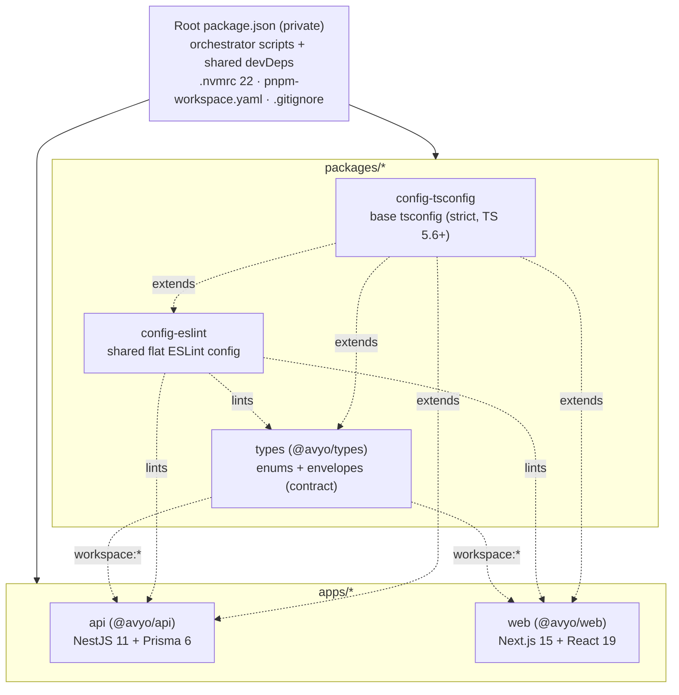
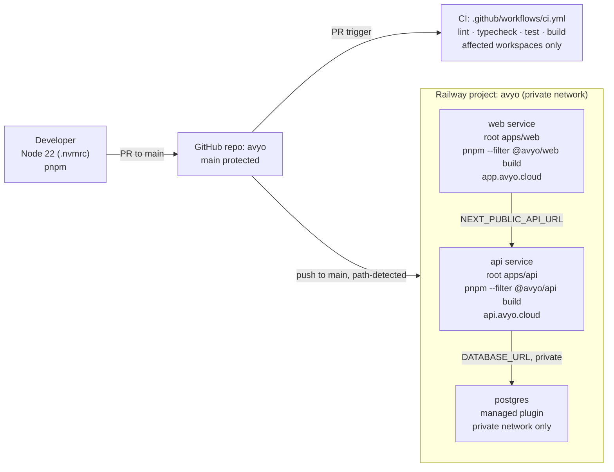

# Design Document — Monorepo Setup

## Overview

This design describes how to scaffold the **Avyo** monorepo: a single GitHub repository (`avyo`) managed with **pnpm workspaces**, containing two deployable apps (`apps/api`, `apps/web`) and three internal packages (`packages/types`, `packages/config-eslint`, `packages/config-tsconfig`), plus CI (GitHub Actions) and Railway deploy configuration.

The output of this spec is **structure and configuration only** — no domain behavior. Module folders exist as registered placeholders; the shared contract package exports type/enum skeletons; the API and web apps compile and boot but implement no endpoints or pages beyond what is needed to prove the foundation is sound. Every subsequent feature spec (auth, bird, genetics, …) builds on this locked foundation.

All versions, names, and conventions are dictated by the authoritative references and are treated as **locked**:

- `mvp-project.md` sections 2.1 (stack), 6 (API contract), 10 (structure), 11.4 (config)
- `.kiro/steering/tech.md` (stack versions), `structure.md` (layout + module list), `devops.md` (CI + Railway)

Locked stack (from `tech.md` / `mvp-project.md` §2.1): Node.js **22 LTS**, TypeScript **5.6+ (<6)**, pnpm, NestJS **11.x**, Prisma **6.x**, PostgreSQL **17.x**, Next.js **15.x**, React / React DOM **19.x**, TailwindCSS **v4.x**, shadcn/ui, TanStack Query **v5.x**.

### Migration note

The existing `api.avyo.cloud` repository stops being a root project and becomes the `apps/api` directory inside the new `avyo` monorepo (`mvp-project.md` §10.1). The current workspace is greenfield — only `mvp-project.md`, `README.md`, `LICENSE`, `.gitignore`, and `.kiro/` exist — so scaffolding is created fresh, and the existing API code is relocated under `apps/api` as a follow-up migration step outside this spec's file-generation scope.

### Deferred decisions (out of scope)

The pending decisions in `mvp-project.md` §11 are **not resolved here** and are deferred to later specs:

- Captcha provider (hCaptcha / reCAPTCHA / Turnstile) — §11.4
- Transactional email provider (SMTP / Resend / SES) — §11.4
- `aviary` modeling (own table vs. columns on `user`) — §11.1

This spec only reserves `CAPTCHA_*` and `MAIL_*` placeholder keys in `apps/api/.env.example` so the shape is discoverable; concrete variable names/values are finalized when the provider is chosen.

## Architecture

### Workspace topology



Dependency direction is strictly one-way: config packages and `@avyo/types` are consumed by the apps; nothing in `packages/*` depends on `apps/*`. `@avyo/types` is referenced through the pnpm `workspace:` protocol so the contract is never duplicated or published (Req 1.6).

### Runtime / deploy topology



Requirements mapping: workspace topology → Req 1, 4, 5, 6; runtime/deploy → Req 12 (CI), Req 13 (Railway), Req 14 (hygiene).

### Build & tooling model

- **Version locking (Req 2):** `.nvmrc` = `22`; root `engines.node` = `>=22`; root `packageManager` pins pnpm; TypeScript pinned `>=5.6 <6` everywhere. `engine-strict=true` (via root `.npmrc`; note pnpm uses the singular `engine-strict` key, not npm's `engines-strict`) makes pnpm abort install on a Node version mismatch instead of warning (Req 2.5).
- **Orchestration (Req 3):** root scripts fan out with `pnpm -r` (recursive) for `lint`/`typecheck`/`test` across all workspaces, and `pnpm -r --filter "./apps/*"` for `build` (only deployables). `pnpm -r` exits non-zero and names the failing workspace when any member fails (Req 3.5).
- **Shared config inheritance (Req 4, 5):** each workspace `tsconfig.json` uses `"extends": "@avyo/config-tsconfig/base.json"`; each workspace `eslint.config.mjs` re-exports the array from `@avyo/config-eslint`. Consumers add no rules of their own beyond framework-required glue, so all consumers apply an identical rule set at one resolved version.

## Components and Interfaces

### Root workspace

| Artifact | Purpose | Requirements |
|----------|---------|--------------|
| `pnpm-workspace.yaml` | Declares exactly `apps/*` and `packages/*` | 1.1, 1.2 |
| `package.json` (root) | `private: true`; `packageManager`; `engines.node >=22`; scripts `lint`/`typecheck`/`test`/`build`; shared devDeps (TypeScript `>=5.6 <6`, ESLint, Prettier) | 2.2, 2.4, 3.1–3.7 |
| `.npmrc` | `engine-strict=true` (pnpm's singular key) to fail install on Node mismatch | 2.5 |
| `.nvmrc` | Content exactly `22` | 2.1 |
| `.gitignore` | Ignore `.env`/`.env.*` (keep `.env.example`), `node_modules`, `dist`, `.next`, `build` | 14.1, 14.2, 14.4 |

Root `package.json` script contract:

```jsonc
{
  "private": true,
  "packageManager": "pnpm@9.x.x",
  "engines": { "node": ">=22" },
  "scripts": {
    "lint":      "pnpm -r lint",
    "typecheck": "pnpm -r typecheck",
    "test":      "pnpm -r test",
    "build":     "pnpm -r --filter \"./apps/*\" build"
  }
}
```

### packages/config-tsconfig

Exports a `base.json` compiler configuration: `strict: true`, `target`/`lib` for modern Node, `moduleResolution: "bundler"` or `"nodenext"` as appropriate, `declaration: true`, `esModuleInterop`, `skipLibCheck`. No `name`-collisions; package name `@avyo/config-tsconfig`. Consumers extend it and may override (e.g., web sets `jsx`, api sets `emitDecoratorMetadata`/`experimentalDecorators`) while retaining all non-overridden options (Req 5.1–5.6).

### packages/config-eslint

Package `@avyo/config-eslint` exporting a single flat-config array (ESLint 9 flat config, `eslint.config` style) built from `@eslint/js`, `typescript-eslint`, and Prettier compatibility. Consuming workspaces re-export it verbatim:

```js
// apps/api/eslint.config.mjs
import config from "@avyo/config-eslint";
export default config;
```

If the shared config cannot be resolved, ESLint fails to load its config and the lint run exits non-zero with a resolution error — no partial/fallback rule set is applied (Req 4.1–4.6).

### packages/types (@avyo/types)

Single entry point (`src/index.ts` compiled to `dist/index.js` + `dist/index.d.ts`) exporting the whole contract skeleton so consumers never need subpath imports (Req 6.7). Built as a TS library: `tsc` emits JS + declaration files; `package.json` sets `main`, `types`, and `exports` to the single entry. Enums are emitted as real runtime values; envelopes are generic types. Detailed shapes in **Data Models**.

### apps/api (@avyo/api)

```
apps/api/
├── prisma/
│   ├── schema.prisma      # datasource postgresql (env DATABASE_URL) + client generator
│   ├── migrations/        # (empty, versioned dir)
│   └── seed.ts            # placeholder: runs, exits 0, writes nothing
├── src/
│   ├── main.ts            # bootstrap; listens on process.env.PORT
│   ├── app.module.ts      # imports ConfigModule + all 13 MVP modules
│   ├── common/
│   │   ├── guards/        │ interceptors/ │ filters/ │ decorators/ │ prisma/
│   ├── config/            # env schema + validate() aborting on missing/invalid
│   └── modules/           # 13 placeholder module folders (each *.module.ts)
├── test/
├── .env.example
├── nest-cli.json
├── tsconfig.json          # extends @avyo/config-tsconfig/base.json
└── package.json           # name @avyo/api
```

Interfaces / contracts:

- **`main.ts`** bootstraps the Nest app and calls `app.listen(config.PORT)` (Req 7.1).
- **`app.module.ts`** imports the config module and registers all 13 `MVP_Modules` (`auth`, `bird`, `genetics`, `calendar`, `band`, `band-color`, `cage`, `species`, `official-color`, `color-class`, `status`, `management`, `aviary`) — each folder holds at minimum a `*.module.ts` decorated with `@Module({})` and imported in `AppModule.imports` (Req 7.2, 7.6).
- **`src/common/`** contains exactly the five subdirectories `guards/`, `interceptors/`, `filters/`, `decorators/`, `prisma/`, each with a `.gitkeep`/index placeholder (Req 7.3).
- **`src/config/`** exposes a validation function over `process.env` with a schema of required variables; on bootstrap it validates presence and type and throws (aborting startup, before `listen`) if any are missing/invalid, naming each offender (Req 7.4, 7.5).
- **Prisma (Req 8):** `schema.prisma` declares `datasource db { provider = "postgresql"; url = env("DATABASE_URL") }` and `generator client { provider = "prisma-client-js" }`; `seed.ts` is a no-op that exits 0; `package.json` registers `"prisma": { "seed": "ts-node prisma/seed.ts" }`. Prisma CLI + Client pinned `>=6 <7`.
- **`.env.example` (Req 9):** documented keys `DATABASE_URL`, `JWT_SECRET`, `JWT_EXPIRES_IN`, `REFRESH_SECRET`, `REFRESH_EXPIRES_IN`, `PORT`, at least one `CAPTCHA_*`, at least one `MAIL_*`, each with a comment and a non-secret placeholder.
- NestJS pinned `>=11 <12` (Req 7.8). `pnpm --filter @avyo/api build` exits 0 with build output (Req 7.7).

### apps/web (@avyo/web)

```
apps/web/
├── src/
│   ├── app/               # layout.tsx (root) + page.tsx (root); providers mounted here
│   ├── components/ui/     # shadcn/ui target dir
│   ├── lib/               # api-client.ts (reads NEXT_PUBLIC_API_URL) + query-provider.tsx
│   └── hooks/             # shared React hooks
├── public/
├── .env.example
├── next.config.ts
├── components.json        # shadcn/ui config
├── tailwind.config / globals.css (Tailwind v4)
├── tsconfig.json          # extends @avyo/config-tsconfig/base.json
└── package.json           # name @avyo/web
```

Interfaces / contracts:

- **`src/app/layout.tsx`** is the root layout; it wraps the tree in the TanStack Query provider (Req 10.1, 10.3). **`page.tsx`** is a minimal root page.
- **`src/lib/api-client.ts`** reads `process.env.NEXT_PUBLIC_API_URL` for its base URL (Req 10.3).
- **`src/lib/query-provider.tsx`** instantiates a `QueryClient` and returns a `QueryClientProvider` client component wrapping `children` (Req 10.3).
- **Tailwind v4** wired via `@import "tailwindcss"` in `globals.css` + PostCSS plugin so utility classes are processed in App Router output (Req 10.5).
- Dependencies pinned: Next `15.x`, React / React DOM `19.x`, TanStack Query `5.x`, shadcn/ui (Req 10.6). `pnpm --filter @avyo/web build` on Node 22 exits 0 (Req 10.7); on failure exits non-zero, names the failing file, emits no artifact (Req 10.8).
- **`.env.example` (Req 11):** exactly `NEXT_PUBLIC_API_URL` (example absolute http/https URL) and `NEXT_PUBLIC_CAPTCHA_SITE_KEY`, each `key=placeholder`.

### CI — .github/workflows/ci.yml (Req 12)

- Triggers on `pull_request` targeting `main` (Req 12.6).
- Steps: checkout → setup Node 22 (matching `.nvmrc`) → setup pnpm with dependency cache → `pnpm install --frozen-lockfile` → run `lint`, `typecheck`, `test`, `build` (Req 12.2, 12.3, 12.4).
- **Affected detection (Req 12.5):** use `pnpm --filter "...[origin/main]"` (changed workspaces + dependents) so only affected workspaces run; unaffected are skipped. Path filters guard whole-job execution where cheaper.
- Any non-zero stage fails the check; all-green reports passing (Req 12.7, 12.8).

### Railway deploy configuration (Req 13)

Documented in the design + a `docs/deploy.md` (or README deploy section). One Railway project `avyo`, three services on the private network:

| Service | Root Directory | Build | Domain | Exposure |
|---------|----------------|-------|--------|----------|
| `api` | `apps/api` | `pnpm --filter @avyo/api build` | `api.avyo.cloud` | public |
| `web` | `apps/web` | `pnpm --filter @avyo/web build` | `app.avyo.cloud` | public |
| `postgres` | — (managed plugin) | — | none | private network only |

- Path-based redeploy: a push to `main` touching only one service's paths rebuilds only that service (Req 13.6).
- `api` start/release command runs `prisma migrate deploy` before serving; on failure the deploy aborts, the previous version keeps running, and the failure appears in deploy logs (Req 13.7, 13.8).
- Secrets (`DATABASE_URL`, JWT/refresh secrets, captcha/mail) live as Railway service env vars, never in the repo; only `.env.example` is versioned (Req 13.9, 14.1, 14.2). Documentation states `main` is protected, no direct pushes, PR-only integration, and untracking guidance for any already-tracked secret file (Req 14.3, 14.5).

## Data Models

All contract fields use **snake_case** to match the API body contract in `mvp-project.md` §6 (Req 6.6). These live in `@avyo/types` and are the single shared source for web and api.

### Enums (Req 6.1, 6.2)

```ts
export enum sex {
  M = "M",
  F = "F",
}

export enum age_group {
  young = "young",
  adult = "adult",
}
```

Exactly two members each, no others.

### Pagination_Envelope (Req 6.3, 6.4)

```ts
export interface Pagination_Links {
  first: string;
  last: string;
  prev: string | null; // nullable
  next: string | null; // nullable
}

export interface Pagination_Meta {
  current_page: number; // non-negative integer
  from: number | null;  // nullable
  last_page: number;    // non-negative integer
  per_page: number;     // non-negative integer
  to: number | null;    // nullable
  total: number;        // non-negative integer
}

export interface Pagination_Envelope<T> {
  data: T;
  links: Pagination_Links;
  meta: Pagination_Meta;
}
```

Nullability: `links.prev`, `links.next`, `meta.from`, `meta.to` are nullable; `current_page`, `last_page`, `per_page`, `total` are non-negative integers. The `data` field is generic so each endpoint keys it by entity (`{ "<entity>": [...] }`) per §6.

### Error_Envelope (Req 6.5)

```ts
export interface Error_Detail {
  field: string;
  message: string;
}

export interface Error_Body {
  code: string;
  message: string;
  details?: Error_Detail[]; // omitted when empty
}

export interface Error_Envelope {
  error: Error_Body;
}
```

`details` is optional and omitted when there are no field-level errors, otherwise a list of `field`/`message` entries, per §6.

### API config schema (Req 7.4)

Not a shared type; internal to `apps/api/src/config`. Conceptually a record of required env vars with expected types, used by the validation function:

| Variable | Type | Required | Notes |
|----------|------|----------|-------|
| `DATABASE_URL` | string (URL) | yes | postgres connection |
| `JWT_SECRET` | string | yes | HS256 secret |
| `JWT_EXPIRES_IN` | string/number | yes | e.g. `86400` |
| `REFRESH_SECRET` | string | yes | refresh signing |
| `REFRESH_EXPIRES_IN` | string/number | yes | refresh TTL |
| `PORT` | integer | yes | listen port |
| `CAPTCHA_*` | string | deferred | placeholder group |
| `MAIL_*` | string | deferred | placeholder group |

The validation function returns a typed, parsed config on success or throws listing every missing/invalid variable on failure.

## Error Handling

Because this spec produces scaffolding, "error handling" means **failing loudly and early** at the tooling, boot, and deploy boundaries rather than runtime domain error handling.

| Boundary | Failure condition | Behavior | Requirements |
|----------|-------------------|----------|--------------|
| Dependency install | Active Node does not satisfy `>=22` | `engine-strict=true` (pnpm's singular key) aborts install with a Node version-mismatch error; no deps installed | 2.5 |
| Root orchestrator scripts | Any workspace fails `lint`/`typecheck`/`test`/`build` | `pnpm -r` exits non-zero and identifies the failing workspace | 3.5 |
| Shared ESLint config | Consumer cannot resolve `@avyo/config-eslint` | Lint run exits non-zero with a resolution error; no partial/fallback rules applied | 4.6 |
| Shared tsconfig | Consumer cannot resolve base config | Type-check fails with "base configuration could not be located"; no build output | 5.5 |
| API bootstrap | Required env var missing/invalid | `config` validation throws before `listen`, naming every offending variable; server does not start | 7.4, 7.5 |
| API build | Compilation error | `pnpm --filter @avyo/api build` exits non-zero; no artifact | 7.7 |
| Prisma | `schema.prisma` invalid | `prisma generate` reports schema validation errors and fails | 8.7 |
| Web build/type-check | Compilation error | Exits non-zero, names the failing file/module, emits no deployable artifact | 10.8 |
| CI | Any stage non-zero | Check reported failed; never reported passing | 12.7 |
| Railway `api` deploy | `prisma migrate deploy` fails | Deploy aborts, previous version kept running, failure surfaced in deploy logs | 13.8 |

Guiding principle: no silent fallbacks. A missing shared config, a bad env var, or a failed migration must stop the pipeline/boot, not degrade to a partial state.

## Testing Strategy

### Why property-based testing does not apply here

This spec is **infrastructure and scaffolding only** and contains no business logic amenable to universal properties:

- The workspace layout, `pnpm-workspace.yaml`, root scripts, `.nvmrc`, `.gitignore`, `nest-cli.json`, `next.config.ts`, and CI/Railway configuration are **declarative configuration / IaC** — validated with existence, structure, and smoke checks, not `for-all-inputs` properties.
- `@avyo/types` exports **pure type and enum declarations** with no functions, transformations, parsers, or serializers authored in this spec — there is no operation to quantify over (round-trip/invariant/idempotence). Serializers and DTO logic that would justify property tests are deferred to later feature specs.
- The API **env validation** is **config/schema validation**, which the testing guidance explicitly routes to schema-validation and example-based tests rather than PBT.
- CI and Railway behavior are **external-service / infrastructure integration** concerns, validated with 1–3 representative runs, not high-iteration property tests.

Accordingly, the **Correctness Properties section is intentionally omitted**. When feature specs introduce real logic (e.g., the pagination interceptor that builds `links`/`meta`, DTO (de)serialization, genetics CTE assembly), those specs SHOULD add property-based tests (round-trip and invariant properties on the `@avyo/types` envelopes are the natural first candidates).

### Structure / smoke tests

Single-execution checks that the scaffold is correct:

- `pnpm-workspace.yaml` declares exactly `apps/*` and `packages/*`, and resolves exactly the five expected members (Req 1.1, 1.2).
- Each workspace `package.json` declares the expected `name` (`@avyo/api`, `@avyo/web`, `@avyo/types`, plus the two config packages) (Req 1.3–1.5, 1.7).
- `.nvmrc` content is exactly `22`; root `engines.node` is `>=22`; TypeScript resolves to `>=5.6 <6` in every workspace (Req 2.1–2.3).
- `apps/api/src/common/` contains exactly the five subdirectories; `src/modules/` contains exactly the 13 placeholder module folders, each with a `*.module.ts` imported by `AppModule` (Req 7.3, 7.6).
- `.env.example` files contain exactly/at-least the required keys with non-secret placeholders and comments (Req 9, 11).
- `.gitignore` excludes `.env`/`.env.*` (keeps `.env.example`), `node_modules`, `dist`, `.next`, `build` (Req 14.1, 14.2, 14.4).

### Build / integration tests

End-to-end proof the foundation compiles and boots (run in CI on Node 22):

- `pnpm install --frozen-lockfile` succeeds on Node 22; fails on Node <22 (Req 2.5).
- `pnpm -r typecheck` and `pnpm -r lint` pass across all workspaces, proving shared tsconfig/eslint inheritance resolves (Req 3.1, 3.2, 4.x, 5.x).
- `pnpm --filter @avyo/api build` and `pnpm --filter @avyo/web build` exit 0 with output (Req 7.7, 10.7).
- `prisma generate` produces the client with no schema errors; `prisma db seed` (the placeholder `seed.ts`) runs to completion, exits 0, writes nothing (Req 8.3, 8.7).
- CI runs `lint`/`typecheck`/`test`/`build` for affected workspaces, fails on any non-zero stage, passes when all green (Req 12.2, 12.5, 12.7, 12.8).

### Example / edge-case unit tests

Concrete-example tests for the small amount of logic and for boundary behavior:

- API config validation: with all required vars present → returns typed config; with one missing → throws naming that variable; with an invalid type (e.g., non-numeric `PORT`) → throws naming that variable (Req 7.4, 7.5).
- `main.ts` binds to the `PORT` value from validated config (example test with a fixed port).
- `@avyo/types` entry point: importing `sex`, `age_group`, `Pagination_Envelope`, and `Error_Envelope` from the package root type-checks without subpath imports (compile-time example) (Req 6.7); enums have exactly their two members (Req 6.1, 6.2).

### Test tooling

- API: Jest (NestJS default) for config-validation unit tests and boot smoke tests.
- Web: build-based verification (`next build`) plus lightweight component/setup tests as needed.
- `@avyo/types`: `tsc --noEmit` type-level checks (the contract is validated by compilation).
- Structure/config assertions: a small script or Jest suite asserting file presence and manifest fields, runnable in CI.

Each app exposes `lint`, `typecheck`, `test`, and `build` scripts so the root orchestrators and CI can invoke them uniformly.
