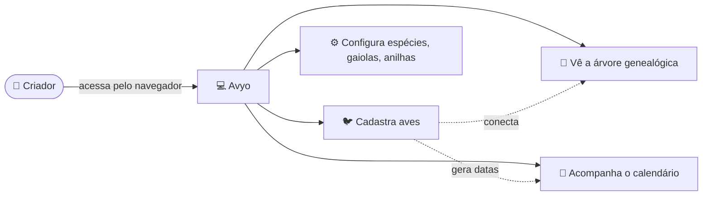
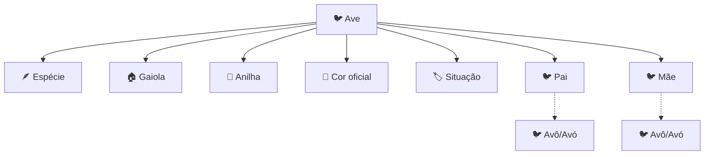
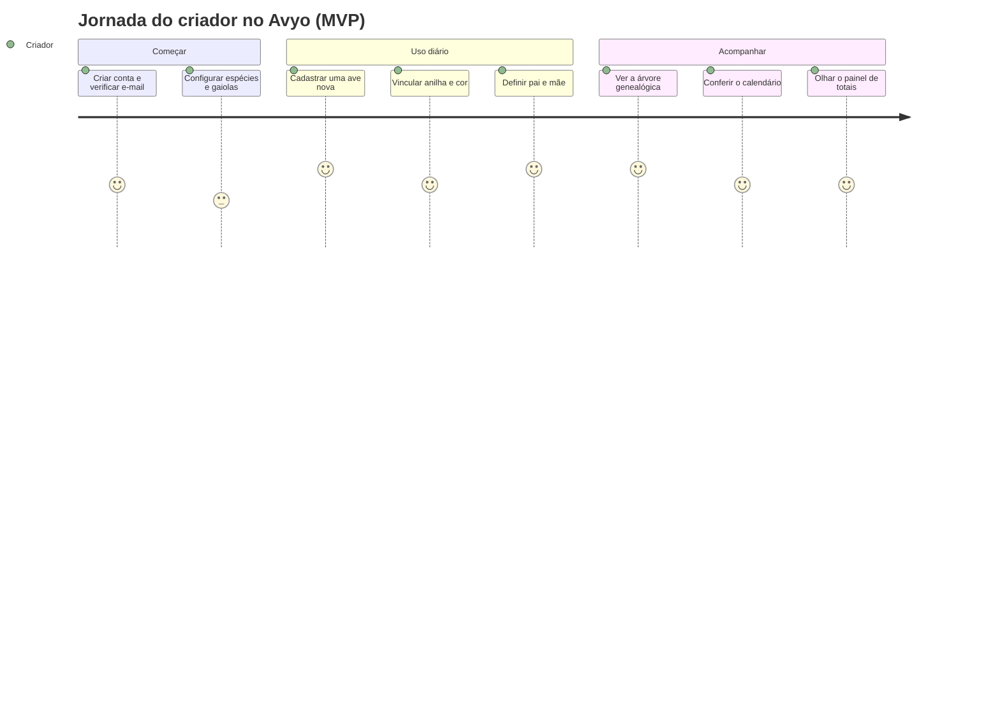
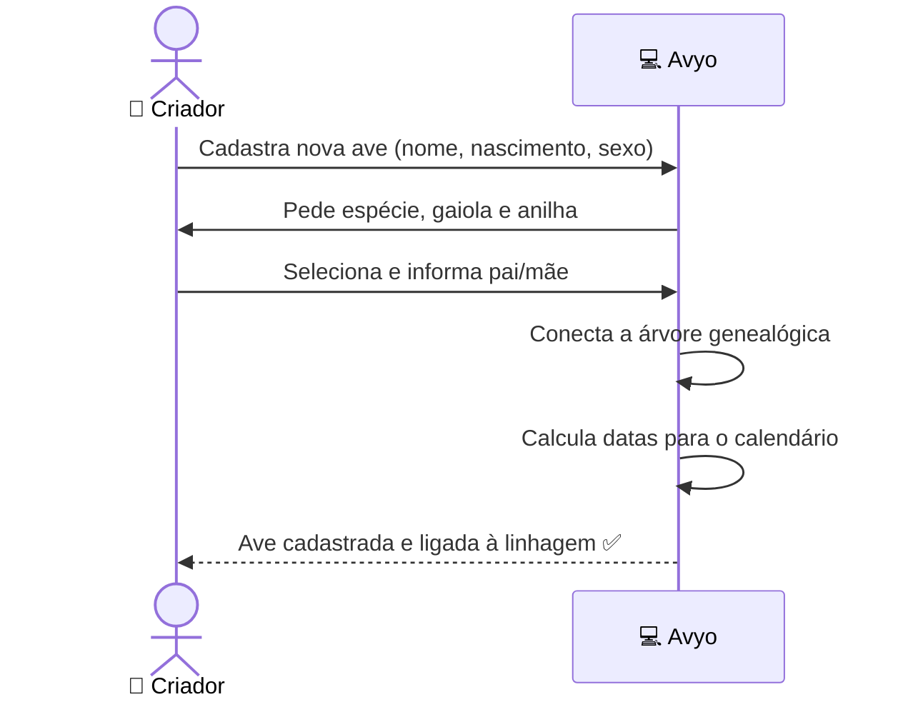
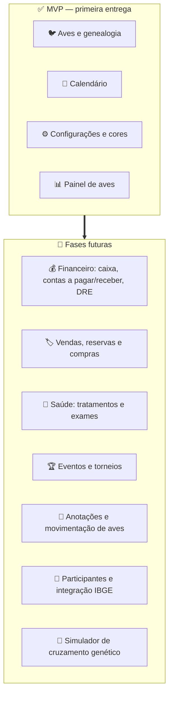
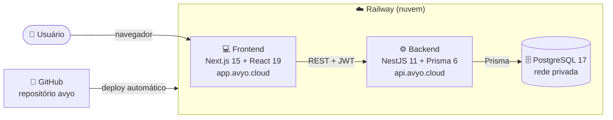

# 🐦 Avyo

**Avyo** é um sistema de gestão de criatório de pássaros com genética compartilhada.
Ele ajuda criadores a organizar suas aves, acompanhar a linhagem (quem é filho de
quem), controlar anilhas, gaiolas, espécies e cores — tudo em um só lugar,
acessível pelo navegador.

> Em uma frase: **o "prontuário digital" do seu criatório**, do cadastro da ave
> à árvore genealógica.

---

## 📖 Índice

- [Para quem é](#-para-quem-é)
- [O problema que resolve](#-o-problema-que-resolve)
- [Como funciona (visão simples)](#-como-funciona-visão-simples)
- [O que entra no MVP](#-o-que-entra-no-mvp-primeira-entrega)
- [Jornada do usuário](#-jornada-do-usuário)
- [Onde o projeto pode chegar](#-onde-o-projeto-pode-chegar-escopo-completo)
- [Como o sistema é montado (técnico)](#-como-o-sistema-é-montado-técnico)
- [Status do projeto](#-status-do-projeto)

---

## 👤 Para quem é

Criadores de pássaros — de quem tem poucas aves de estimação a criatórios
maiores, que participam de torneios e precisam comprovar a linhagem dos animais.

## 🎯 O problema que resolve

Hoje muitos criadores controlam tudo em cadernos, planilhas ou na memória. Isso
gera problemas comuns:

- Perder o histórico de quem é pai/mãe de cada ave
- Não saber qual anilha está livre ou já usada
- Esquecer datas importantes (nascimento, troca de anilha, separação)
- Dificuldade de comprovar a genética de uma ave na hora de vender ou competir

O Avyo organiza tudo isso de forma simples e visual.

---

## 🔎 Como funciona (visão simples)

O criador acessa pelo navegador, cadastra suas aves e o sistema conecta cada
informação automaticamente: a ave pertence a uma espécie, mora em uma gaiola,
usa uma anilha, tem uma cor e tem pai e mãe.

Cada ave vira um registro completo e ligado aos demais:

---

## ✅ O que entra no MVP (primeira entrega)

O MVP (Produto Mínimo Viável) foca no coração do sistema: **cadastrar aves e
enxergar sua genética**. É o que entrega valor imediato ao criador.

| Módulo | O que faz |
|--------|-----------|
| 🔐 **Conta e login** | Cadastro, login seguro e verificação de e-mail |
| 🐦 **Aves** | Cadastro completo: nome, nascimento, sexo, mutação, espécie, gaiola, anilha, cor, situação, pai e mãe |
| 🧬 **Genealogia** | Árvore genealógica automática (pais, avós…) e rastreabilidade por anilha |
| 📅 **Calendário** | Datas importantes derivadas das aves: nascimentos e estimativas de anilhamento e separação |
| 📊 **Painel** | Totais de aves (machos, fêmeas, filhotes) e gráficos por situação, espécie e manejo |
| ⚙️ **Configurações** | Espécies, gaiolas, anilhas e cores da anilha, situações e manejos |
| 🎨 **Catálogo de cores** | Cores oficiais e classes de cor (base compartilhada do sistema) |

Cada criador enxerga **apenas os seus próprios dados** — o sistema isola as
informações por usuário desde o primeiro dia.

---

## 🚶 Jornada do usuário

Da criação da conta ao acompanhamento da genética:

Exemplo de como uma ave nasce no sistema:

---

## 🚀 Onde o projeto pode chegar (escopo completo)

O MVP é a fundação. A visão completa transforma o Avyo em uma plataforma
completa de gestão do criatório, incluindo o lado financeiro e de eventos.

Com o escopo completo, o criador poderá:

- **Controlar o financeiro**: caixa, contas a pagar/receber e demonstrativo de resultado (DRE)
- **Gerenciar o comercial**: vendas, reservas e compras de aves
- **Acompanhar a saúde**: tratamentos, medicamentos e calendário de exames
- **Registrar eventos**: torneios e as aves participantes
- **Simular cruzamentos**: prever resultados genéticos antes de acasalar
- **Ter um calendário completo**: reunindo reproduções, nascimentos, vendas, contas e tratamentos

---

## 🛠️ Como o sistema é montado (técnico)

O Avyo é construído inteiramente em **TypeScript**, do banco de dados ao
frontend, e hospedado na **Railway**.

**Stack principal:**

| Camada | Tecnologia |
|--------|-----------|
| Frontend | Next.js 15 · React 19 · Tailwind v4 · shadcn/ui · TanStack Query |
| Backend | NestJS 11 (TypeScript) |
| Autenticação | JWT (HS256) + refresh token |
| Banco de dados | PostgreSQL 17 · Prisma 6 |
| Hospedagem | Railway (web + api + postgres) |
| Repositório | GitHub (monorepo `avyo`) |

📄 A especificação técnica completa está em **[`mvp-project.md`](./mvp-project.md)**.

---

## 📌 Status do projeto

🚧 **Em definição** — a especificação do MVP está pronta e o projeto está sendo
estruturado para o início do desenvolvimento.

- [x] Especificação do MVP (`mvp-project.md`)
- [x] Definição da estrutura do monorepo
- [x] Diretrizes de desenvolvimento (steering)
- [ ] Scaffolding do projeto (apps/api + apps/web)
- [ ] Fundação + autenticação
- [ ] Módulos do MVP

---

Avyo — gestão de criatório de pássaros e genética compartilhada.
